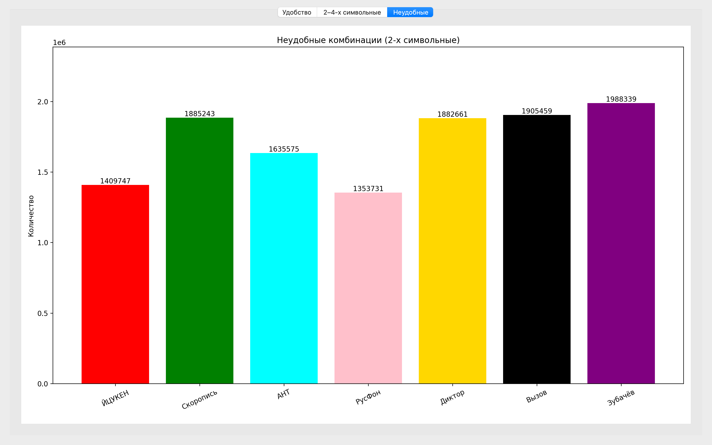

# 🧠 Keyboard Typing-Master


Инструмент для анализа и визуального сравнения эффективности различных раскладок клавиатуры при десятипальцевом методе печати.  
Проект моделирует движения пальцев, рассчитывает нагрузку и визуализирует результаты на основе реальных текстов.

---

## 📚 Содержание

- [🛠 Технологии](#-технологии)
- [⌨️ Раскладки клавиатур](#-раскладки-клавиатур)
- [🧪 Тестирование](#-тестирование)
- [📊 Модуль графиков](#-модуль-графиков)
- [📈 Сравнительный анализ](#-сравнительный-анализ)
- [✅ Вывод](#-вывод)
- [👥 Команда проекта](#-команда-проекта)
- [📖 Источники](#-источники)

---

## 🛠 Технологии

- **Python 3.8+** — основной язык
- **PyQt5** — графический интерфейс
- **matplotlib** — визуализация графиков
- **Sphinx** — генерация документации

---
## ⌨️ Раскладки клавиатур

### Раскладка ЙЦУКЕН


### Раскладка Вызов


### Раскладка Зубачев


### Раскладка Скоропись


### Раскладка Русфон


### Раскладка Диктор


### Раскладка Ант


---

## 🧪 Тестирование

Модульное тестирование выполнено с помощью [pytest](https://docs.pytest.org/).  
Каждая функция проверяется на **7 различных раскладках клавиатуры**, включая `standard`, `challenge`, `zubachev` и другие.

- ✅ **Всего выполнено**: 58 тестов  
- 🧩 **Охват**: анализ текста, распределение нагрузки, визуализация  

### 📦 Команда для запуска

```bash
python -m pytest test.py -v
```````
<summary>📊 Пример вывода pytest</summary>

```text
test_analyze_text[icuken] PASSED
test_analyze_text[vyzov] PASSED
...
=========================== 58 passed in 1.23s ============================
```````
---

## 📊 Модуль графиков

### Сравнение 2-4 грамм


### Процент удобства переходов


### Неудобные для двухсимвольных


---

## 📈 Сравнительный анализ

### ⚖️ Сравнение удобства n-грамм по раскладкам

| Раскладка | 2-граммы удобные | % | 2-граммы частично | % | 3-граммы удобные | % | 3-граммы частично | % | 4-граммы удобные | % | 4-граммы частично | % |
|-----------|------------------|------|--------------------|------|------------------|------|--------------------|------|------------------|------|--------------------|------|
| **ЙЦУКЕН**    | 358 565 | 27.9% | 927 766 | 72.1% | 158 687 | 26.1% | 450 208 | 73.9% | 11 492 | 4.3% | 256 967 | 95.7% |
| **Скоропись** | 325 553 | 44.3% | 409 500 | 55.7% | 82 178  | 71.4% | 32 905  | 28.6% | 1 078  | 2.7% | 38 886  | 97.3% |
| **АНТ**       | 339 160 | 33.5% | 673 813 | 66.5% | 324 202 | 60.1% | 215 342 | 39.9% | 2 450  | 1.4% | 169 302 | 98.6% |
| **РусФон**    | 524 392 | 38.7% | 829 255 | 61.3% | 243 181 | 35.4% | 443 438 | 64.6% | 9 643  | 3.3% | 278 464 | 96.7% |
| **Вызов**     | 296 734 | 42.5% | 401 683 | 57.5% | 82 742  | 30.6% | 187 365 | 69.4% | 11 389 | 10.8% | 93 903  | 89.2% |
| **Диктор**    | 273 902 | 43.8% | 351 171 | 56.2% | 280 704 | 62.6% | 167 591 | 37.4% | 11 497 | 13.9% | 70 797  | 86.1% |
| **Зубачёв**   | 286 408 | 39.2% | 444 231 | 60.8% | 53 587  | 71.9% | 20 951  | 28.1% | 3 960  | 18.7% | 17 228  | 81.3% |

---

#### 🔹 2-граммы
- **Скоропись**, **Вызов**, **Диктор** и **Зубачёв** показывают умеренный комфорт (≈40–44%).
- **ЙЦУКЕН** и **АНТ** — ниже среднего.
- **РусФон** — лучший по количеству, но не по проценту.

#### 🔹 3-граммы
- **Зубачёв** и **Скоропись** — лидеры по проценту удобных триграмм (≈72%).
- **АНТ** и **Диктор** — сбалансированные (≈60%).
- **РусФон**, **Вызов**, **ЙЦУКЕН** — преимущественно частично удобные.

#### 🔹 4-граммы
- Все раскладки имеют низкий процент удобных квадриграмм.
- **Зубачёв** — лучший по проценту (18.7%), **Диктор** — второй (13.9%).
- **ЙЦУКЕН**, **Скоропись**, **АНТ**, **РусФон** — менее 5%.

---

#### 🏁 Выводы

- **Зубачёв** — лидер по удобству 3- и 4-грамм, но уступает в 2-граммах.  
- **АНТ** и **Диктор** — сбалансированные по всем категориям.  
- **Скоропись** — неожиданно сильна в 3-граммах.  
- **ЙЦУКЕН** — стабильно слабая по всем типам n‑грамм..  
- **РусФон** — высокая частичная удобность, особенно в длинных комбинациях.

---

### 📈 Процент удобства переходов по раскладкам

| Раскладка   | Удобные (%) | Частично (%) | Неудобные (%) |
|-------------|-------------|---------------|----------------|
| **ЙЦУКЕН**   | 15.2%       | 45.6%         | 39.2%          |
| **Скоропись**| 13.8%       | 23.8%         | 62.4%          |
| **АНТ**      | 16.4%       | 34.7%         | 48.9%          |
| **РусФон**   | 22.4%       | 41.4%         | 36.2%          |
| **Диктор**   | 13.9%       | 23.8%         | 62.3%          |
| **Вызов**    | 14.7%       | 22.8%         | 62.4%          |
| **Зубачёв**  | 11.7%       | 20.7%         | 67.7%          |

---

#### 🧠 Выводы

- 🔹 **РусФон** — лидер по удобным переходам (**22.4%**) и один из самых сбалансированных по частично/неудобным.
- 🔹 **АНТ** — второе место по удобным переходам (**16.4%**) и умеренный уровень неудобных (**48.9%**).
- 🔹 **ЙЦУКЕН** — средний уровень удобства, но высокая доля частично удобных (**45.6%**).
- ⚠️ **Скоропись**, **Диктор**, **Вызов** — крайне неудобны: более **62%** неудобных переходов при низком комфорте.
- ⚠️ **Зубачёв** — наименьший процент удобных переходов (**11.7%**) и самый высокий процент неудобных (**67.7%**).

---

### 📈 Сравнение неудобных (2-х симольных) комбинаций

| Раскладка   | Неудобные 2-граммы |
|-------------|---------------------|
| **ЙЦУКЕН**   | 1 409 747           |
| **Скоропись**| 1 885 243           |
| **АНТ**      | 1 635 575           |
| **РусФон**   | 1 353 731           |
| **Диктор**   | 1 882 661           |
| **Вызов**    | 1 905 459           |
| **Зубачёв**  | 1 988 339           |

---

#### 🧠 Выводы

- ✅ **РусФон** — наименьшее количество неудобных 2-грамм (**1 353 731**), лучший результат по этой метрике.
- ✅ **ЙЦУКЕН** — второй по удобству (**1 409 747**), несмотря на слабые показатели в других категориях.
- ⚖️ **АНТ** — средний результат, но всё ещё выше 1.6 млн неудобных пар.
- ⚠️ **Скоропись**, **Диктор**, **Вызов** — все имеют более **1.88 млн** неудобных комбинаций, что указывает на низкую эргономику при наборе пар символов.
- ⚠️ **Зубачёв** — наихудший результат (**1 988 339**), что контрастирует с его успехами в удобных 3- и 4-граммах.

---


## 🏁 Общий итог

- **РусФон** — наиболее сбалансированная раскладка:
  - Лидер по минимальному количеству неудобных 2-грамм.
  - Высокий процент удобных переходов (22.4%) и умеренный уровень частично удобных.
  - Сильные позиции по количеству удобных комбинаций.

- **АНТ** — уверенный претендент:
  - Высокий процент удобных комбинаций (особенно 3-грамм).
  - Средний уровень неудобных переходов.
  - Умеренное количество неудобных 2-грамм.

- **Диктор** — сбалансирован по удобству 3-грамм, но проигрывает в переходах:
  - Хорошие показатели по удобным 3-граммам.
  - Высокий процент неудобных переходов (62.3%).
  - Среднее количество неудобных 2-грамм.

- **Зубачёв**:
  - Лидер по количеству удобных 3- и 4-грамм.
  - Но худший по переходам (67.7% неудобных) и количеству неудобных 2-грамм.
  - Подходит для набора длинных последовательностей, но не для плавного ввода.

- **ЙЦУКЕН**:
  - Стабильно слабая по всем метрикам.
  - Низкий процент удобных комбинаций и переходов.
  - Высокое количество неудобных 2-грамм.

- **Скоропись**, **Вызов**:
  - Самые высокие показатели неудобных переходов (>62%).
  - Низкий процент удобных комбинаций.
  - Большое количество неудобных 2-грамм.

---

## 👥 Команда проекта

### 🧠 Shandina Veronika — тим-лидер и разработчик логики анализа

- Руководила архитектурой проекта
- Написала код для `main.py`, реализующий анализ трёх раскладок клавиатуры
- Разработала алгоритмы расчёта штрафов и распределения нагрузки

---

### 📊 Varzieva Marina — разработчик визуализации

- Создала графики и диаграммы для `gui.py`
- Реализовала интерфейс на PyQt5
- Отвечала за визуальное представление результатов анализа

---

### 🧪 Anokhina Varvara — тестировщик

- Разработала тесты для проверки функций из `main.py`
- Проверяла корректность расчёта штрафов и обработки текстов
- Участвовала в отладке и стабилизации логики

---

### 📚 Roganova Sofia — автор документации

- Оформила техническую документацию проекта (Sphinx)
- Структурировала описание модулей, классов и функций
- Создала навигацию по документации и README

---

## 📖 Источники

В процессе разработки мы опирались на следующие ресурсы и идеи:

### 📚 Документация и оформление

- [RealPython: Creating Great README Files](https://realpython.com/readme-python-project/) — рекомендации по структуре и стилю README 
- [Habr: Как создать README для Python-проекта](https://habr.com/ru/articles/725132/) — русскоязычное руководство с примерами оформления 

### 📊 Визуализация

- [matplotlib](https://matplotlib.org/) — библиотека для построения графиков
- [PyQt5](https://pypi.org/project/PyQt5/) — фреймворк для создания GUI

### 🛠 Документация проекта

- [Sphinx](https://www.sphinx-doc.org/) — генерация документации
- [sphinx-design](https://sphinx-design.readthedocs.io/) — интерактивные элементы и блоки
