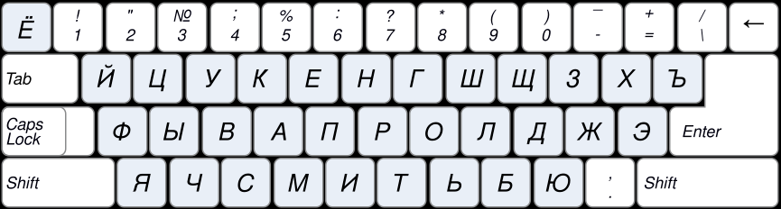
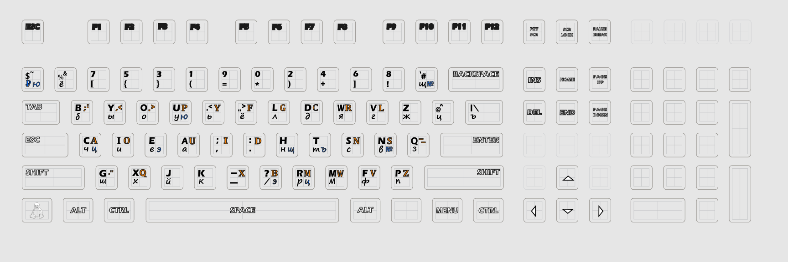
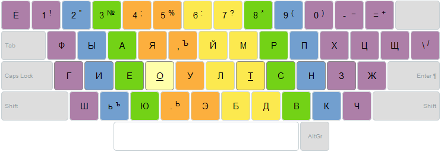
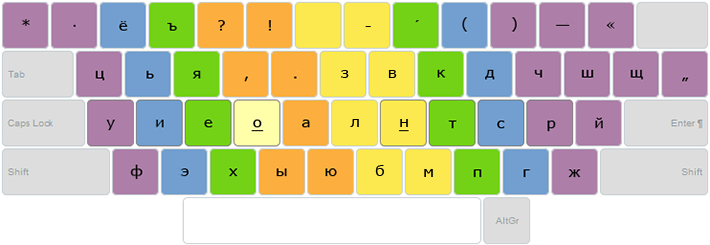
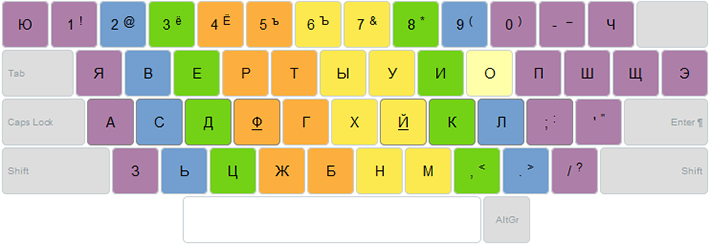
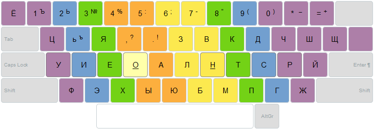
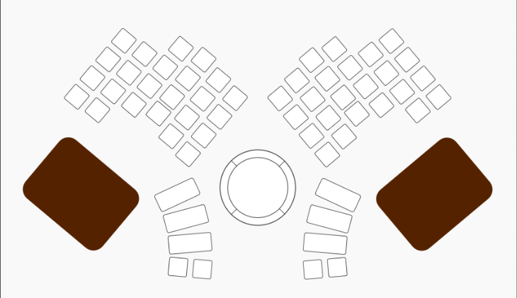
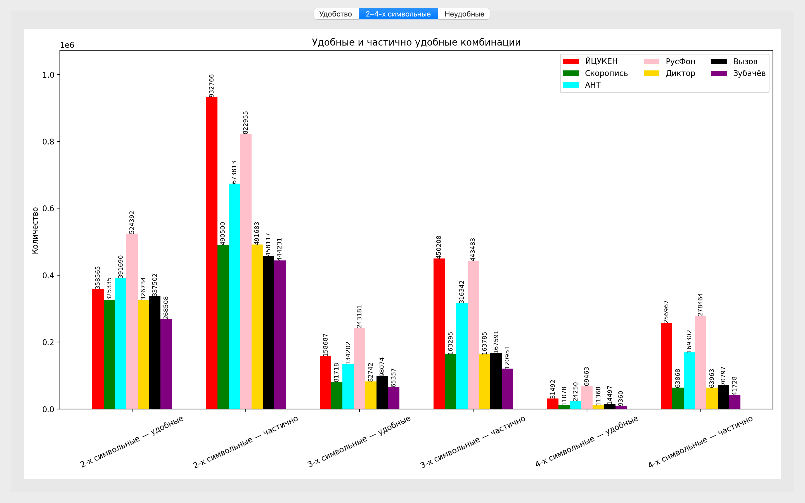
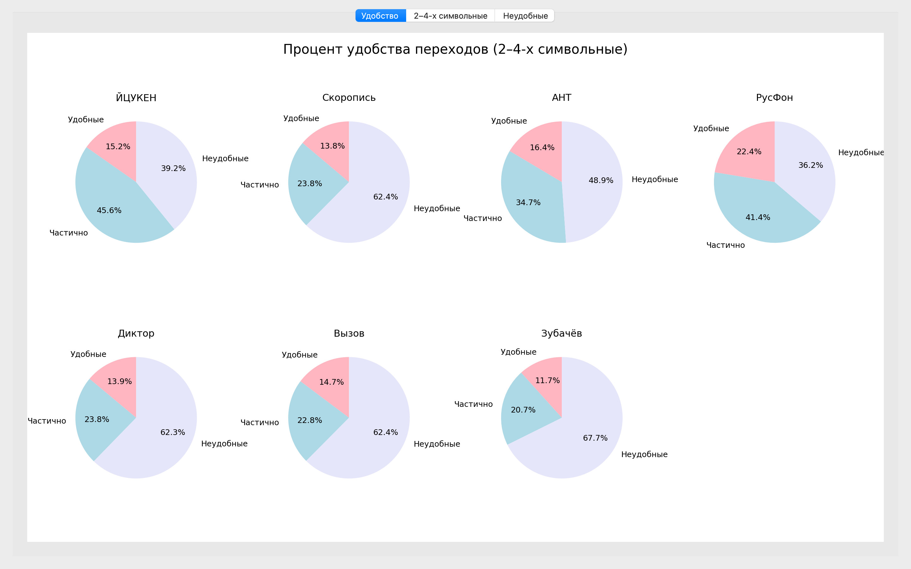

# 🧠 Keyboard Typing-Master


Инструмент для анализа и визуального сравнения эффективности различных раскладок клавиатуры при десятипальцевом методе печати.  
Проект моделирует движения пальцев, рассчитывает нагрузку и визуализирует результаты на основе реальных текстов.

---

## 📚 Содержание

- [🛠 Технологии](#-технологии)
- [⌨️ Раскладки клавиатур](#-раскладки-клавиатур)
- [🧪 Тестирование](#-тестирование)
- [📊 Модуль графиков](#-модуль-графиков)
- [📈 Сравнительный анализ](#-сравнительный-анализ)
- [✅ Вывод](#-вывод)
- [👥 Команда проекта](#-команда-проекта)
- [📖 Источники](#-источники)

---

## 🛠 Технологии

- **Python 3.8+** — основной язык
- **PyQt5** — графический интерфейс
- **matplotlib** — визуализация графиков
- **Sphinx** — генерация документации

---
## ⌨️ Раскладки клавиатур

### Раскладка ЙЦУКЕН



### Раскладка Вызов



### Раскладка Зубачев



### Раскладка Скоропись



### Раскладка Русфон



### Раскладка Диктор



### Раскладка Ант



---

## 🧪 Тестирование

Модульное тестирование выполнено с помощью [pytest](https://docs.pytest.org/).  
Каждая функция проверяется на **7 различных раскладках клавиатуры**, включая `standard`, `challenge`, `zubachev` и другие.

- ✅ **Всего выполнено**: 58 тестов  
- 🧩 **Охват**: анализ текста, распределение нагрузки, визуализация  

### 📦 Команда для запуска

```bash
python -m pytest test.py -v
```````
<summary>📊 Пример вывода pytest</summary>

```text
test_analyze_text[icuken] PASSED
test_analyze_text[vyzov] PASSED
...
=========================== 58 passed in 1.23s ============================
```````
---

## 📊 Модуль графиков

### Сравнение 2-4 грамм


### Процент удобства переходов


---

## 📈 Сравнительный анализ

### ⚖️ Сравнение удобства n-грамм по раскладкам

Анализ показывает, какие раскладки клавиатуры дают наибольшее количество удобных комбинаций для 2‑грамм, 3‑грамм и 4‑грамм.

#### ✅ 2‑граммы

| Раскладка   | Удобных | Доля (%) |
|-------------|---------|----------|
| **РусФон**  | 524 642 | **20.9%** |
| АНТ         | 391 908 | 15.6%     |
| ЙЦУКЕН      | 358 819 | 14.3%     |
| Вызов       | 337 716 | 13.4%     |
| Диктор      | 326 983 | 13.0%     |
| Скоропись   | 325 576 | 13.0%     |
| Зубачёв     | 268 737 | 10.7%     |

**Лидер:** РусФон — максимальное количество удобных двухграмм.

---

#### ✅ 3‑граммы

| Раскладка   | Удобных | Доля (%) |
|-------------|---------|----------|
| **РусФон**  | 38 240  | **24.7%** |
| Вызов       | 25 888  | 16.7%     |
| АНТ         | 20 417  | 13.2%     |
| ЙЦУКЕН      | 18 216  | 11.8%     |
| Диктор      | 11 246  | 7.3%      |
| Скоропись   | 10 798  | 7.0%      |
| Зубачёв     | 5 388   | 3.5%      |

**Лидер:** РусФон — почти четверть всех удобных трёхграмм.

---

#### ✅ 4‑граммы

| Раскладка   | Удобных | Доля (%) |
|-------------|---------|----------|
| **Вызов**   | 840     | **27.5%** |
| РусФон      | 781     | 25.6%     |
| АНТ         | 324     | 10.6%     |
| ЙЦУКЕН      | 132     | 4.3%      |
| Диктор      | 29      | 0.9%      |
| Скоропись   | 29      | 0.9%      |
| Зубачёв     | 8       | 0.3%      |

**Лидер:** Вызов — лучший по удобству длинных комбинаций.

---

#### 🏁 Итог

- **РусФон** — абсолютный лидер по 2‑граммам и 3‑граммам, второй по 4‑граммам.  
- **Вызов** — лучший по 4‑граммам, второй по 3‑граммам.  
- **АНТ** — стабильно входит в тройку лидеров.  
- **ЙЦУКЕН**, **Диктор**, **Скоропись**, **Зубачёв** — заметно уступают по удобству длинных последовательностей.

---

### 📈 Процент удобства переходов по раскладкам

#### 🟢 Удобные раскладки  
(высокий процент «Удобные» и «Частично»)

| Раскладка | Удобные | Частично | Неудобные |
|-----------|---------|----------|-----------|
| **РусФон**  | 7.0%    | 34.7%    | 58.3%     |
| АНТ         | 5.1%    | 25.0%    | 69.9%     |
| ЙЦУКЕН      | 4.7%    | 34.3%    | 61.1%     |

**Вывод:**  
- **РусФон** — самая сбалансированная раскладка по удобству переходов.  
- **АНТ** и **ЙЦУКЕН** — умеренно удобные, особенно за счёт высокой доли «Частично».

---

#### 🟡 Частично удобные раскладки  
(низкий процент «Удобные», но умеренная доля «Частично»)

| Раскладка   | Удобные | Частично | Неудобные |
|-------------|---------|----------|-----------|
| Вызов       | 4.5%    | 16.0%    | 79.5%     |
| Диктор      | 4.2%    | 16.3%    | 79.5%     |
| Скоропись   | 4.1%    | 16.2%    | 79.6%     |

**Вывод:**  
- Эти раскладки дают немного удобных переходов, но могут быть приемлемы за счёт частично удобных.

---

#### 🔴 Неудобные раскладки  
(минимальный процент «Удобные» и «Частично», максимальный «Неудобные»)

| Раскладка   | Удобные | Частично | Неудобные |
|-------------|---------|----------|-----------|
| Зубачёв     | 3.4%    | 13.3%    | 83.3%     |

**Вывод:**  
- **Зубачёв** — наименее удобная раскладка по переходам: более 83% неудобных комбинаций.

---

## ✅ Вывод

### 🔹 РусФон
- **Переходы:** лидер по удобству — максимальный процент «Удобные» (7%) и высокая доля «Частично» (34.7%).  
- **N‑граммы:** абсолютный лидер по 2‑граммам и 3‑граммам, второй по 4‑граммам.  
- **Итог:** самая сбалансированная раскладка, обеспечивающая и удобные переходы, и высокую эффективность длинных комбинаций.

---

### 🔹 Вызов
- **Переходы:** средний уровень удобства (4.5% удобные, 16% частично).  
- **N‑граммы:** лидер по 4‑граммам, второй по 3‑граммам.  
- **Итог:** сильна в длинных комбинациях, но уступает по общему удобству переходов.

---

### 🔹 АНТ
- **Переходы:** неплохой баланс (5.1% удобные, 25% частично).  
- **N‑граммы:** стабильно в тройке лидеров по всем категориям.  
- **Итог:** универсальная раскладка, надёжный «середнячок» с хорошим потенциалом.

---

### 🔹 ЙЦУКЕН
- **Переходы:** умеренно удобная (4.7% удобные, 34.3% частично).  
- **N‑граммы:** средние показатели, заметно уступает РусФон и Вызову.  
- **Итог:** привычная раскладка, но не оптимальна по эффективности.

---

### 🔹 Диктор и Скоропись
- **Переходы:** низкий уровень удобства (около 4% удобные, ~16% частично, почти 80% неудобные).  
- **N‑граммы:** средние показатели, без лидерства.  
- **Итог:** уступают по всем параметрам, требуют доработки.

---

### 🔹 Зубачёв
- **Переходы:** худший результат — 83.3% неудобных переходов.  
- **N‑граммы:** минимальные показатели по всем категориям.  
- **Итог:** самая слабая раскладка как по переходам, так и по комбинациям.

---

## 👥 Команда проекта

### 🧠 Shandina Veronika — тим-лидер и разработчик логики анализа

- Руководила архитектурой проекта
- Написала код для `main.py`, реализующий анализ трёх раскладок клавиатуры
- Разработала алгоритмы расчёта штрафов и распределения нагрузки

---

### 📊 Varzieva Marina — разработчик визуализации

- Создала графики и диаграммы для `gui.py`
- Реализовала интерфейс на PyQt5
- Отвечала за визуальное представление результатов анализа

---

### 🧪 Anokhina Varvara — тестировщик

- Разработала тесты для проверки функций из `main.py`
- Проверяла корректность расчёта штрафов и обработки текстов
- Участвовала в отладке и стабилизации логики

---

### 📚 Roganova Sofia — автор документации

- Оформила техническую документацию проекта (Sphinx)
- Структурировала описание модулей, классов и функций
- Создала навигацию по документации и README

---

## 📖 Источники

В процессе разработки мы опирались на следующие ресурсы и идеи:

### 📚 Документация и оформление

- [RealPython: Creating Great README Files](https://realpython.com/readme-python-project/) — рекомендации по структуре и стилю README 
- [Habr: Как создать README для Python-проекта](https://habr.com/ru/articles/725132/) — русскоязычное руководство с примерами оформления 

### 📊 Визуализация

- [matplotlib](https://matplotlib.org/) — библиотека для построения графиков
- [PyQt5](https://pypi.org/project/PyQt5/) — фреймворк для создания GUI

### 🛠 Документация проекта

- [Sphinx](https://www.sphinx-doc.org/) — генерация документации
- [sphinx-design](https://sphinx-design.readthedocs.io/) — интерактивные элементы и блоки
