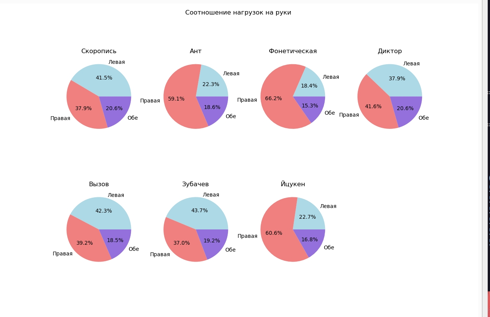
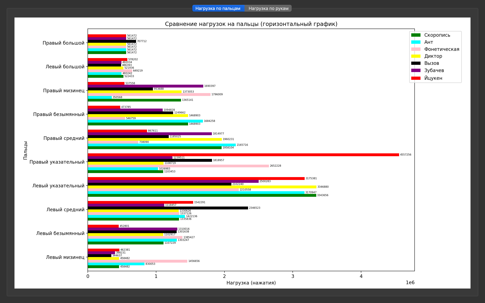

# 🧠 Keyboard Typing-Master


Инструмент для анализа и визуального сравнения эффективности различных раскладок клавиатуры при десятипальцевом методе печати.  
Проект моделирует движения пальцев, рассчитывает нагрузку и визуализирует результаты на основе реальных текстов.

---

## 📚 Содержание

- [🛠 Технологии](#-технологии)
- [⌨️ Раскладки клавиатур](#-раскладки-клавиатур)
- [🧪 Тестирование](#-тестирование)
- [📊 Модуль графиков](#-модуль-графиков)
- [📈 Выводы по графикам](#-выводы-по-графикам)
- [👥 Команда проекта](#-команда-проекта)
- [📖 Источники](#-источники)

---

## 🛠 Технологии

- **Python 3.8+** — основной язык
- **PyQt5** — графический интерфейс
- **matplotlib** — визуализация графиков
- **Sphinx** — генерация документации

---
## ⌨️ Раскладки клавиатур

### Раскладка ЙЦУКЕН


### Раскладка Вызов


### Раскладка Зубачев


### Раскладка Скоропись


### Раскладка Русфон


### Раскладка Диктор


### Раскладка Ант


---

## 🧪 Тестирование

Модульное тестирование выполнено с помощью [pytest](https://docs.pytest.org/).  
Каждая функция проверяется на **7 различных раскладках клавиатуры**, включая `standard`, `challenge`, `zubachev` и другие.

- ✅ **Всего выполнено**: 58 тестов  
- 🧩 **Охват**: анализ текста, распределение нагрузки, визуализация  

### 📦 Команда для запуска

```bash
python -m pytest test.py -v
```````
<summary>📊 Пример вывода pytest</summary>

```text
test_analyze_text[icuken] PASSED
test_analyze_text[vyzov] PASSED
...
=========================== 58 passed in 1.23s ============================
```````
---

## 📊 Модуль графиков

Графический интерфейс включает три вкладки, каждая из которых визуализирует нагрузку на пальцы, руки и раскладки клавиатуры:

### Нагрузка на руку


### Нагрузка на пальцы


---

## 📈 Выводы по графикам

Графики позволяют визуально сравнить эффективность и нагрузку разных раскладок клавиатуры. Ниже приведены основные наблюдения:

### ⚖️ Нагрузка на руку

Анализ круговых диаграмм показывает, как разные раскладки клавиатуры распределяют нагрузку между левой, правой и обеими руками. Ниже представлены ключевые наблюдения и сравнительные выводы.

---

#### 🟥 Праворукие раскладки (перегрузка правой руки)

| Раскладка      | Левая | Правая | Обе |
|----------------|-------|--------|-----|
| Ант            | 22.3% | 59.1%  | 18.6% |
| Фонетическая   | 18.4% | 66.2%  | 15.3% |
| Йцукен         | 22.7% | 60.6%  | 16.8% |

**Вывод:** Эти раскладки создают значительную нагрузку на правую руку.  
**Риски:** Возможна усталость правой кисти при длительном наборе.

---

#### 🟦 Леворукие раскладки (перегрузка левой руки)

| Раскладка   | Левая | Правая | Обе |
|-------------|-------|--------|-----|
| Зубачев     | 43.7% | 37.0%  | 19.2% |
| Вызов       | 42.3% | 39.2%  | 18.5% |
| Скоропись   | 41.5% | 37.9%  | 20.6% |

**Вывод:** Эти раскладки нагружают левую руку больше, чем правую.  
**Преимущества:** Подходят для левшей или для компенсации правой перегрузки.

---

#### 🟪 Сбалансированные раскладки

| Раскладка | Левая | Правая | Обе |
|-----------|-------|--------|-----|
| Диктор    | 37.9% | 41.6%  | 20.6% |

**Вывод:** «Диктор» — наиболее сбалансированная раскладка по нагрузке между руками.  
**Преимущества:** Подходит для длительного набора без явного перекоса.

---

##### 🎯 Общие рекомендации

- **Для равномерной нагрузки** — используйте раскладки «Диктор» или «Скоропись».
- **Для правшей** — подойдут «Фонетическая» и «Йцукен», но возможна перегрузка.
- **Для левшей** — комфорт обеспечивают «Зубачев» и «Вызов».
- **Модификаторы (Shift + Alt)** — занимают стабильные 15–21% нагрузки во всех раскладках.

### 🔍 Нагрузка на пальцы
Горизонтальный график показывает, как различные раскладки клавиатуры распределяют нагрузку по каждому пальцу. Это важно для оценки эргономики, утомляемости и потенциальных рисков при длительном наборе текста.

---

#### 🟦 Левый мизинец
- В раскладках «Скоропись», «Зубачев», «Вызов» нагрузка заметно выше, чем в «Йцукен» и «Фонетическая».
- Часто используется для символов и редких букв, что делает его уязвимым к перегрузке.
- 📌 **Вывод:** перегрузка мизинца снижает комфорт, особенно при длительном наборе.

---

#### 🟦 Левый безымянный
- Получает умеренную нагрузку, но в «Зубачев» и «Вызов» она выше среднего.
- В «Йцукен» и «Фонетическая» нагрузка минимальна.
- 📌 **Вывод:** раскладки с акцентом на левую руку делают безымянный более активным, что требует адаптации.

---

#### 🟦 Левый средний
- В большинстве раскладок нагрузка средняя, но в «Скоропись» и «Зубачев» он используется чаще.
- 📌 **Вывод:** нагрузка равномерна, но в леворуких раскладках этот палец играет ключевую роль.

---

#### 🟦 Левый указательный
- Один из самых загруженных пальцев во всех раскладках.
- Особенно активен в «Скоропись», «Зубачев» и «Вызов».
- 📌 **Вывод:** левый указательный — основной рабочий палец в леворуких раскладках.

---

#### 🟥 Правый указательный
- Лидер по нагрузке в «Йцукен», «Фонетическая» и «Ант».
- 📌 **Вывод:** перегрузка правого указательного характерна для стандартных и праворуких раскладок.

---

#### 🟥 Правый средний
- Получает умеренную нагрузку, но в «Фонетическая» и «Ант» выше среднего.
- 📌 **Вывод:** нагрузка не критична, но заметна в праворуких раскладках.

---

#### 🟥 Правый безымянный
- В «Фонетическая» и «Ант» нагрузка выше, чем в «Скоропись» или «Зубачев».
- 📌 **Вывод:** палец используется чаще в праворуких раскладках, но остаётся второстепенным.

---

#### 🟥 Правый мизинец
- В «Йцукен» и «Фонетическая» нагрузка особенно высокая.
- 📌 **Вывод:** перегрузка правого мизинца — слабое место классических раскладок, повышает риск усталости.

---

#### 🟦 Левый большой
- Почти не используется во всех раскладках.
- 📌 **Вывод:** упущенный потенциал — можно было бы задействовать для пробела или модификаторов.

---

#### 🟥 Правый большой
- Аналогично левому — нагрузка минимальна.
- 📌 **Вывод:** роль правого большого пальца ограничена, чаще всего только пробел.

---

##### 🎯 Общие рекомендации

- **Перегрузка мизинцев** — характерна для «Йцукен» и «Фонетическая».  
- **Основная нагрузка на указательные пальцы** — во всех раскладках, но баланс разный.  
- **Большие пальцы почти не участвуют** — это снижает эргономику, хотя они могли бы разгрузить мизинцы.  
- **Для равномерной нагрузки** — лучше подходят «Диктор», «Скоропись», «Зубачев».  
- **Для правшей** — «Йцукен» и «Фонетическая» привычны, но перегружают правую руку.  
- **Для левшей** — «Зубачев» и «Вызов» дают преимущество.  

### ✅ Вывод

Анализ двух графиков — по нагрузке на руки и по нагрузке на пальцы — показывает:

- **Йцукен, Фонетическая, Ант**  
  ➝ Перегружают правую руку и особенно правый указательный/мизинец. Менее эргономичны при длительном наборе.

- **Зубачев, Вызов, Скоропись**  
  ➝ Смещают нагрузку на левую руку. Подходят левшам, но могут утомлять при долгой работе.

- **Диктор**  
  ➝ Наиболее сбалансированная раскладка: равномерное распределение нагрузки как по рукам, так и по пальцам.  
  ✔ Лучший вариант для длительного набора текста без перегрузки.

---

#### 🏆 Лучшие раскладки
- **Диктор** — оптимальный баланс и комфорт.  
- **Скоропись** — близка к балансу, но с акцентом на левую руку.

---

## 👥 Команда проекта

### 🧠 Shandina Veronika — тим-лидер и разработчик логики анализа

- Руководила архитектурой проекта
- Написала код для `main.py`, реализующий анализ трёх раскладок клавиатуры
- Разработала алгоритмы расчёта штрафов и распределения нагрузки

---

### 📊 Varzieva Marina — разработчик визуализации

- Создала графики и диаграммы для `gui.py`
- Реализовала интерфейс на PyQt5
- Отвечала за визуальное представление результатов анализа

---

### 🧪 Anokhina Varvara — тестировщик

- Разработала тесты для проверки функций из `main.py`
- Проверяла корректность расчёта штрафов и обработки текстов
- Участвовала в отладке и стабилизации логики

---

### 📚 Roganova Sofia — автор документации

- Оформила техническую документацию проекта (Sphinx)
- Структурировала описание модулей, классов и функций
- Создала навигацию по документации и README

---

## 📖 Источники

В процессе разработки мы опирались на следующие ресурсы и идеи:

### 📚 Документация и оформление

- [RealPython: Creating Great README Files](https://realpython.com/readme-python-project/) — рекомендации по структуре и стилю README 
- [Habr: Как создать README для Python-проекта](https://habr.com/ru/articles/725132/) — русскоязычное руководство с примерами оформления 

### 📊 Визуализация

- [matplotlib](https://matplotlib.org/) — библиотека для построения графиков
- [PyQt5](https://pypi.org/project/PyQt5/) — фреймворк для создания GUI

### 🛠 Документация проекта

- [Sphinx](https://www.sphinx-doc.org/) — генерация документации
- [sphinx-design](https://sphinx-design.readthedocs.io/) — интерактивные элементы и блоки
