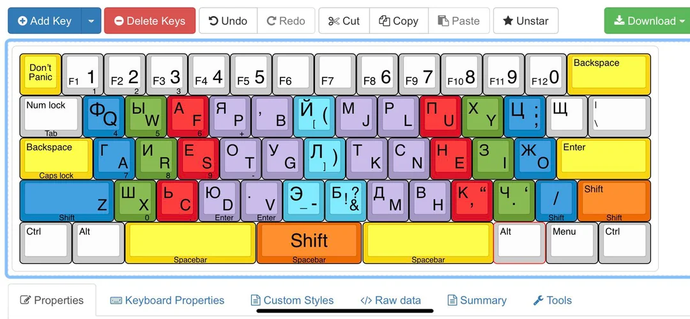
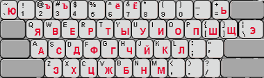

# 🧠 Keyboard Typing-Master


Инструмент для анализа и визуального сравнения эффективности различных раскладок клавиатуры при десятипальцевом методе печати.  
Проект моделирует движения пальцев, рассчитывает нагрузку и визуализирует результаты на основе реальных текстов.

---

## 📚 Содержание

- [🛠 Технологии](#-технологии)
- [⌨️ Раскладки клавиатур](#-раскладки-клавиатур)
- [🧪 Тестирование](#-тестирование)
- [👥 Команда проекта](#-команда-проекта)
- [📖 Источники](#-источники)

---

## 🛠 Технологии

- **Python 3.8+** — основной язык
- **PyQt5** — графический интерфейс
- **matplotlib** — визуализация графиков
- **Sphinx** — генерация документации

---
## ⌨️ Раскладки клавиатур

### Раскладка ЙЦУКЕН


### Раскладка Вызов


### Раскладка Зубачев



### Раскладка Скоропись


### Раскладка Русфон



### Раскладка Диктор


### Раскладка Ант


---

## 🧪 Тестирование

Модульное тестирование выполнено с помощью [pytest](https://docs.pytest.org/).  
Каждая функция проверяется на **7 различных раскладках клавиатуры**, включая `standard`, `challenge`, `zubachev` и другие.

- ✅ **Всего выполнено**: 58 тестов  
- 🧩 **Охват**: анализ текста, распределение нагрузки, визуализация  

### 📦 Команда для запуска

```bash
python -m pytest test.py -v
```````
<summary>📊 Пример вывода pytest</summary>

```text
test_analyze_text[standard] PASSED
test_analyze_text[challenge] PASSED
...
=========================== 58 passed in 1.23s ============================
```````
---

## 👥 Команда проекта

### 🧠 Shandina Veronika — тим-лидер и разработчик логики анализа

- Руководила архитектурой проекта
- Написала код для `main.py`, реализующий анализ трёх раскладок клавиатуры
- Разработала алгоритмы расчёта штрафов и распределения нагрузки

---

### 📊 Varzieva Marina — разработчик визуализации

- Создала графики и диаграммы для `gui.py`
- Реализовала интерфейс на PyQt5
- Отвечала за визуальное представление результатов анализа

---

### 🧪 Anokhina Varvara — тестировщик

- Разработала тесты для проверки функций из `main.py`
- Проверяла корректность расчёта штрафов и обработки текстов
- Участвовала в отладке и стабилизации логики

---

### 📚 Roganova Sofia — автор документации

- Оформила техническую документацию проекта (Sphinx)
- Структурировала описание модулей, классов и функций
- Создала навигацию по документации и README

---

## 📖 Источники

В процессе разработки мы опирались на следующие ресурсы и идеи:

### 📚 Документация и оформление

- [RealPython: Creating Great README Files](https://realpython.com/readme-python-project/) — рекомендации по структуре и стилю README 
- [Habr: Как создать README для Python-проекта](https://habr.com/ru/articles/725132/) — русскоязычное руководство с примерами оформления 

### 📊 Визуализация

- [matplotlib](https://matplotlib.org/) — библиотека для построения графиков
- [PyQt5](https://pypi.org/project/PyQt5/) — фреймворк для создания GUI

### 🛠 Документация проекта

- [Sphinx](https://www.sphinx-doc.org/) — генерация документации
- [sphinx-design](https://sphinx-design.readthedocs.io/) — интерактивные элементы и блоки
